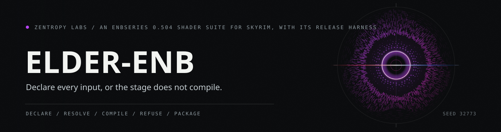

# Elder ENB



Elder ENB is an independently authored ENBSeries 0.504 shader-suite and
release-harness project for Skyrim Special Edition / Anniversary Edition. The
public release target is a restrained, professional, cinematic baseline: one
fixed ENB render order, five real quality tiers, bounded controls, exact
identity fallbacks, and documentation that separates proven source behavior from
unfinished release acceptance.

This checkout is not a Nexus upload artifact. Upload remains blocked until the
final public archive and checksum are produced, inspected, and recorded; live
ENB 0.504 acceptance is recorded at minimum for Performance, Balanced, and
Cinematic; selected no-runtime / missing-runtime checks are recorded; and any
media or visual claims are backed by labeled real in-game captures.


## Public release architecture

The public shader suite is organized around ENB's fixed stage order. Elder
treats that order as an API rather than as a loose pile of effects:

| Order | Stage | File | Stage contract / responsibility | Accepted live behavior in this copy |
|---:|---|---|---|---|
| 1 | Prepass | `shaders/enbeffectprepass.fx` | Depth convention, masks, room-light reach, bounded current-frame AO, and far-depth atmosphere fallback. No live fog behavior is claimed here. | Pending final archive and live ENB 0.504 evidence; unaccepted paths stay identity. |
| 2 | Depth of field | `shaders/enbdepthoffield.fx` | Lens focus only; no grading, vignette, sharpening, or atmosphere. | Pending final archive and live ENB 0.504 evidence; unaccepted paths stay identity. |
| 3 | Bloom | `shaders/enbbloom.fx` | Radiance extraction and filtering. | Pending final archive and live ENB 0.504 evidence; unaccepted paths stay identity. |
| 4 | Adaptation | `shaders/enbadaptation.fx` | Bounded luminance metering / exposure-history contract. | Pending final archive and live ENB 0.504 evidence; unaccepted paths stay identity. |
| 5 | Lens | `shaders/enblens.fx` | Restrained glare, ghost, and halo behavior when final integration is accepted; no dirt pass or dirt texture. | Pending final archive and live ENB 0.504 evidence; no dirt behavior is accepted. |
| 6 | Main effect | `shaders/enbeffect.fx` | Scene, bloom, lens, exposure, color core, tone mapping, and gamut compression. | Pending final archive and live ENB 0.504 evidence; unaccepted paths stay identity. |
| 7 | Postpass | `shaders/enbeffectpostpass.fx` | Final LDR finishing; dithering is last and sharpening is off by default. | Pending final archive and live ENB 0.504 evidence; unaccepted paths stay identity. |
| 8 | Sun sprite | `shaders/enbsunsprite.fx` | Bounded sun optical response without duplicating bloom or exposure. | Pending final archive and live ENB 0.504 evidence; unaccepted paths stay identity. |
| 9 | Underwater | `shaders/enbunderwater.fx` | One underwater medium model while suppressing incompatible air, grading, and duplicate god-ray effects. | Pending final archive and live ENB 0.504 evidence; unaccepted paths stay identity. |

The release target is broader than the earlier dither-focused slice. Temporal
dither is one native helper and optional integration point; the public suite is
the ordered nine-stage shader contract above, with the current implementation
kept identity-preserving where a later visual payload has not yet been accepted.

## Quality tiers


`config/quality-tiers.csv` defines five quality tiers, and
`shaders/elder/ElderQuality.fxh` defaults `ELDER_QUALITY_TIER` to `1`
(`Balanced`):

| Tier | Name | Role |
|---:|---|---|
| 0 | Performance | Essential color / room-light path, low sample budgets, DOF disabled by default, SSR identity/unshipped. |
| 1 | Balanced | Default tier; restrained DOF, low-cost AO budget, simple lens response, stable scene readability. |
| 2 | Quality | Standard optical budgets; SSR budget is reserved/configured only. |
| 3 | Ultra | Higher optical and scene-space budgets with improved depth refinement. |
| 4 | Cinematic | Highest bounded budgets and photographic refinement without effect stacking. |

The public archive must contain complete tier outputs generated from this
manifest, but this README intentionally does not claim a current release-archive
file count. The final package manifest is a release gate, not a marketing
sentence.

Each tier's nine per-stage `.fx.ini` files carry `TECHNIQUE=1` directly under
the stage section. Index 1 selects the first declared Elder technique in that
stage; without the key, ENB falls back to its internal DEFAULT shader in every
stage and none of the Elder passes render.

Reserved/configured SSR budgets are not a live effect claim. SSR remains
identity/unshipped until an implementation is integrated, accepted, and recorded
in the final archive evidence.

## Capability ladder and fail-closed behavior


Every modern technique follows the same route:

1. use a valid native ENB / Elder runtime input;
2. use a versioned SkyrimBridge-compatible value or reconstruction when the
   user has such a bridge and the stage declares that input;
3. use a stable, bounded spatial fallback;
4. return the exact Elder-authored identity when confidence is insufficient.

`shaders/elder/ElderPipelineCommon.fxh` resolves capability in that order and
returns identity when no higher-confidence route is available. Stage intensity
`0` is identity, disabled stages are identity, and non-finite values are handled
at stage boundaries rather than being allowed to leak into later composition.

SkyrimBridge, KreatE, Silent Horizons, AELAS/EVLaS, ELIF, NativeEditorID Fix,
ENBWorldspaceWeatherlists/KiLoader, and other permission-gated or historical
tools are not hard runtime requirements for the independent public suite. Elder
may interoperate with compatible public formats and workflows, but it does not
ship proprietary implementations or permission-dependent replacement components.

## Runtime payload status

The native runtime source defines an optional ENB parameter payload named
`ElderRuntimeFramePulse`. The runtime policy is fail-closed: a withheld,
rejected, malformed, or absent live pulse becomes the all-zero inactive payload
instead of leaving stale values visible to shaders.

Treat all runtime-payload shipping and gameplay claims as conditional until the
public archive proves the runtime is integrated and live ENB 0.504 acceptance is
recorded. If the runtime is not present, shaders must select the documented
fallback or identity path.

## Source areas

- `shaders/` and `shaders/elder/` contain the public ENB stage files and shared
  Elder shader contracts.
- `config/quality-tiers.csv` is the canonical five-tier manifest.
- `native/` contains the typed native parameter ABI, color/room-light helpers,
  artifact publication code, and optional runtime source.
- `src/`, `include/`, and `config/legacy-kreate-bindings.csv` contain the
  transactional profile, legacy metadata/audit, first-five bundle, and weather
  migration tooling. These tools are recovery and generation infrastructure;
  legacy record bodies and protected evidence are not copied into public source
  or package output.
- `CREDITS-AND-PROVENANCE.md` and `THIRD_PARTY_NOTICES.md` record attribution,
  ownership boundaries, and excluded third-party/proprietary material.

## Maintainer build and verification commands

The root CMake presets target Visual Studio 18 2026 x64, C++23, and the static
MSVC runtime:

```powershell
cmake --preset vs2026-x64
cmake --build --preset vs2026-debug
ctest --preset vs2026-debug --output-on-failure --no-tests=error
```

Release gates for the public shader suite are broader than a normal build. The
ordered-suite plan requires strict stage compilation across all five tiers,
native/color/room-light parity checks, generated preset/package determinism,
archive exclusion checks, and live ENB 0.504 acceptance before public upload.
This documentation pass did not run builds, tests, package generation, or live
game validation.

## License

The Elder-owned source and documentation in this repository are licensed under
the MIT License; see [LICENSE](LICENSE). MIT applies only to code and
documentation the project owns. It does not grant rights to ENBSeries,
SkyrimBridge, Kitsuune/LonelyKitsuune/Skratzer/T. Thanner implementations,
ReShade/ADOF work, ReforgedUI, recovered legacy material, protected evidence,
proprietary plugin binaries, or any other third-party material.

Preserve prior shader-author attribution in headers, notices, public pages, and
archives. If the final archive adds any third-party file or linked component,
update `THIRD_PARTY_NOTICES.md` before upload.
